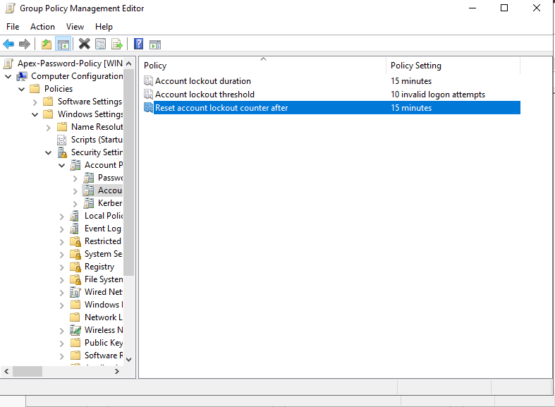
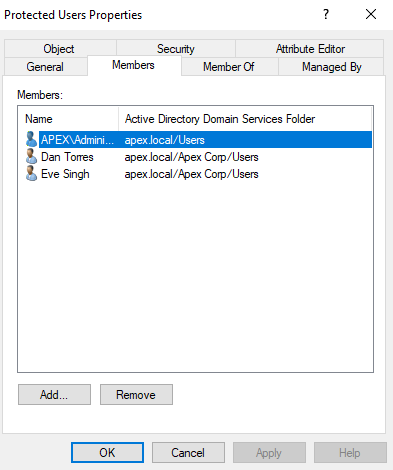
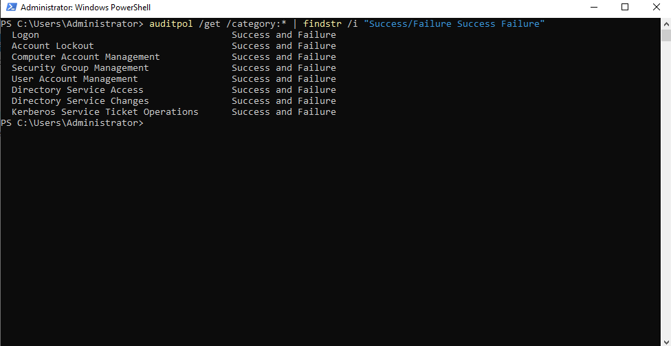
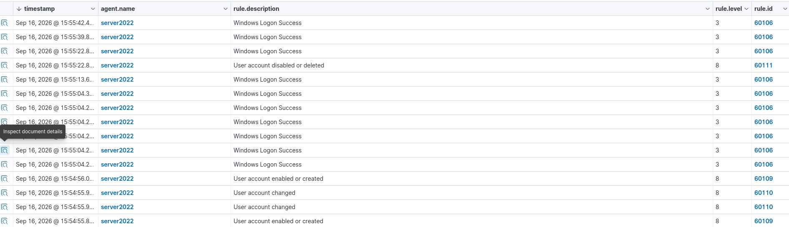
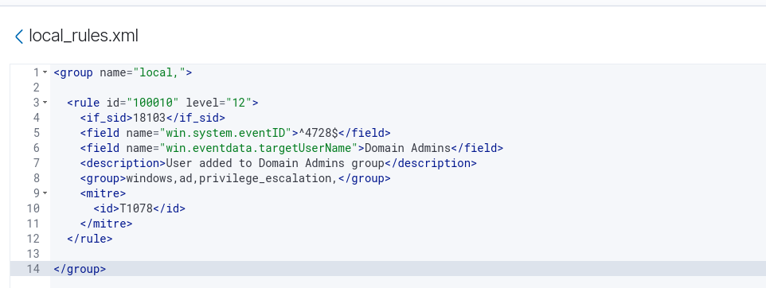
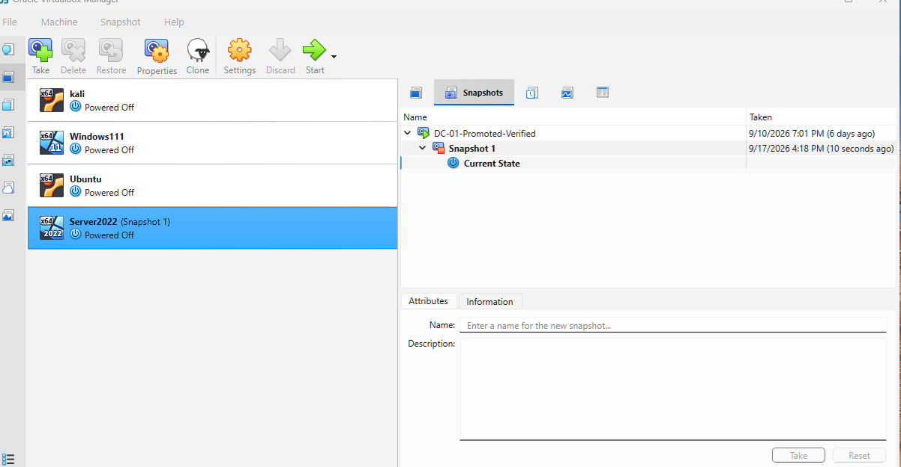

# 🛡️ Active Directory Hardening & Custom SIEM Detection Engineering

## Overview
Build an isolated Active Directory domain environment, implement baseline GPO security hardening and Protected Users account isolation, configure Windows Advanced Audit Policies, forward security event telemetry to a central Wazuh SIEM, and engineer custom detection rules for unauthorized privilege escalation mapped to the MITRE ATT&CK framework. This project teaches identity security controls, audit policy configuration, SIEM log ingestion, custom XML detection engineering, and SOC telemetry validation.

## Step-by-Step Instructions

1. **Set up the virtual lab environment and domain architecture** by configuring host-only and NAT network adapters in Oracle VM VirtualBox for a 192.168.1.0/24 subnet. Install Windows Server 2022 on DC-01 to promote it as a Domain Controller running Active Directory Domain Services (AD DS), and set up Kali Linux to host the centralized Wazuh SIEM stack (Wazuh Manager, Indexer, and Dashboard).

2. **Implement Active Directory security hardening baselines** by launching the Group Policy Management Console (gpmc.msc) on DC-01 and enforcing a  10/15/15 Account Lockout Policy (10 invalid attempts, 15-minute duration, 15-minute reset). Open Active Directory Users and Computers (dsa.msc) and add privileged administrative accounts (dtorres, esingh) to the **Protected Users** security group to eliminate legacy NTLM fallback and cached credential dumping risks.

3. **Configure Windows Advanced Audit Policies** using administrative PowerShell on DC-01. Execute auditpol /set /subcategory:"User Account Management" /success:enable /failure:enable to capture identity lifecycle operations, and run `auditpol /get /category: to verify that active auditing is successfully enabled across user management categories.

4. **Generate and validate Active Directory security telemetry** by executing test user management operations on DC-01 using PowerShell (New-ADUser and Remove-ADUser). Log into the Wazuh Dashboard under Threat Hunting → Events to verify the ingestion of Windows Security Event IDs 4720 (User Account Created), 4726 (User Account Deleted), and 4728 (Member Added to Security-Enabled Global Group).

5. **Engineer custom Wazuh detection rules** by editing /var/ossec/etc/rules/local_rules.xml on the Wazuh Manager. Write custom Rule 100010 set to Level 12 severity targeting Event ID 4728 where targetUserName equals Domain Admins, map the alert to MITRE ATT&CK T1078 (Valid Accounts), and restart the manager via sudo wazuh-control restart.

6. **Validate detection pipeline and preserve lab state** by generating an alert-triggering event on DC-01 (adding a test account to the Domain Admins group) and confirming real-time alert generation in the Wazuh Dashboard. Gracefully shut down all virtual machines and take a clean VirtualBox state snapshot named DC-01-Hardened-Monitored for future threat-simulation exercises.

## Key Concepts to Learn
- Active Directory baseline security & GPO enforcement
- Protected Users group mechanics & Kerberos authentication
- Windows Advanced Audit Policy configuration (auditpol)
- Endpoint log forwarding & SIEM telemetry pipelines (TCP 1514)
- Custom XML detection engineering in Wazuh (local_rules.xml)
- MITRE ATT&CK framework mapping (Technique T1078)
- Virtualization environment management & state snapshots

## Deliverables
- Isolated Active Directory domain & Wazuh SIEM lab environment
- Enforced GPO Account Lockout Policy & Protected Users baseline
- Configured Windows Security audit pipeline forwarding Event IDs 4720, 4726, & 4728
- Custom Wazuh Rule 100010 detecting Domain Admin group modifications
- Validated Level 12 SIEM alert mapped to MITRE ATT&CK T1078
- VirtualBox baseline restoration snapshot (`DC-01-Hardened-Monitored`)
- Professional GitHub portfolio repository with screenshot evidence gallery

---

## 📸 Evidence Gallery

## 📸 Evidence Gallery

| Ref | Verification Artifact | Key Telemetry / Configuration | Preview |
| :---: | :--- | :--- | :---: |
| **01** | **GPO Hardening Baseline** | Enforced Account Lockout Policy |  |
| **02** | **Account Protection** | Privileged accounts (dtorres, esingh) in Protected Users |  |
| **03** | **Advanced Audit Policy** | Enabled Success/Failure auditing via auditpol |  |
| **04** | **Log Ingestion Validation** | Captured Windows Event IDs 4720 and 4726 |  |
| **05** | **Custom Detection Rule** | Level 12 Wazuh Rule 100010 in local_rules.xml |  |
| **06** | **Lab State Preservation** | VirtualBox baseline snapshot (DC-01-Hardened-Monitored) |  |
---

## 👤 Author

**Brandon Smith**  
*Cybersecurity Analyst | Active Directory | SIEM | Detection Engineering*

- **Education & Credentials:** B.S. Cybersecurity | CompTIA Security+
- **GitHub Portfolio:** [github.com/bsmith399/active-directory-siem-lab](https://github.com/bsmith399/active-directory-siem-lab)
